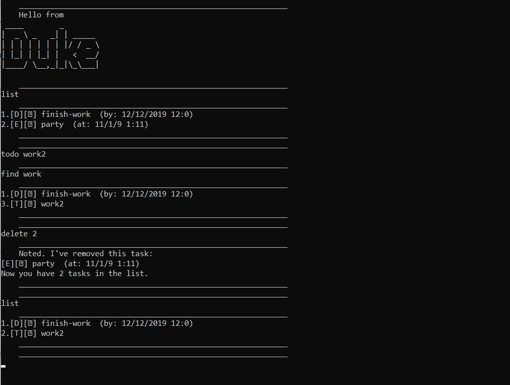

# User Guide for Duke

## Features 

Keep Track of everything! 

On just one command line interface, keep track of all deadlines, events and tasks you may have.

Use commands to add, remove and manage tasks with ease.




## Usage

### `find` - Searches for all tasks with keyword

_Find all tasks whose description contains a word or character._

Example of usage: 

`find abcdef`

Expected outcome:

```
    ____________________________________________________________
find a
    ____________________________________________________________
1.[T][?] task 1
2.[E][?] party  (at: 12/12/2019 23:35)
    ____________________________________________________________
    ____________________________________________________________
```

---

---

### `list` - List all tasks

_Shows a list of all tasks with relevant details and dates_

Example: 

`list`

Expected outcome:

```
    ____________________________________________________________
list
    ____________________________________________________________
1.[T][?] task 1
2.[E][?] party  (at: 12/12/2019 23:35)
3.[D][?] finish work  (by: 23/12/2019 12:0)
    ____________________________________________________________
    ____________________________________________________________

```

---


### `done` - Mark task done

_Mark a particular task as done_

Example: 

`done 2`

Expected outcome:

```
    ____________________________________________________________
done 2
    ____________________________________________________________
     Nice! I've marked this task as done:
[E][?] party  (at: 12/12/2019 23:35)
    ____________________________________________________________
    ____________________________________________________________
```

---
   
   ### `delete` - Deletes task
   
   _Delete a particular task_
   
   Example: 
   
   `delete 3`
   
   Expected outcome:
   
   ```
       ____________________________________________________________
   delete 2
       ____________________________________________________________
       Noted. I've removed this task:
   [E][?] party  (at: 12/12/2019 23:35)
   Now you have 2 tasks in the list.
       ____________________________________________________________
       ____________________________________________________________
   ```

---

### `todo` - Add a todo task

_Add a todo._

Example: 

`todo tasknamesample`

Expected outcome:

```
    ____________________________________________________________
todo task 1
    ____________________________________________________________

```

---

### `event` - Add an event

_Adding an event with a date._

Example of usage: 

`event <description> /at <d/M/yyyy HHmm>`

`e <description> /at <d/M/yyyy HHmm>`

Expected outcome:

```
    ____________________________________________________________
event party /at 12/12/2019 2335
    ____________________________________________________________

```

---

### `deadline` - Add deadline

_Add a deadline._

Example: 

`deadline finish work /by 23/12/2019 1200`

Expected outcome:

```
    ____________________________________________________________
deadline finish work /by 23/12/2019 1200
    ____________________________________________________________

```
---

### `bye` - Ends program

_Ends program and saves list back for future use._

Example: 

`bye`

Expected outcome:

```
    ____________________________________________________________
bye
    ____________________________________________________________
```